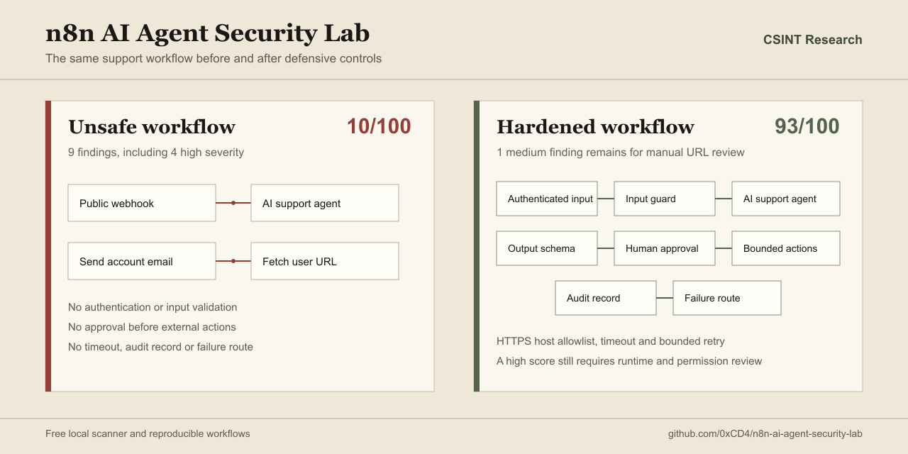
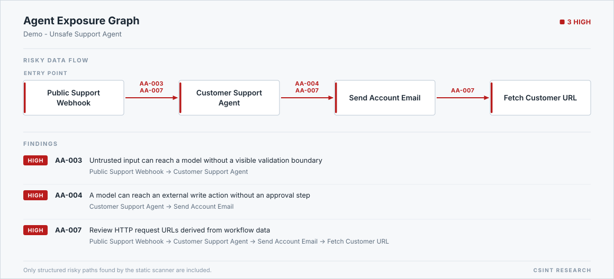

# n8n AI Security Regression Gate

[](https://github.com/0xCD4/n8n-ai-agent-security-lab/actions/workflows/test.yml)
[](LICENSE)

A [CSINT Research](https://en.csintresearch.org/) side project that catches security regressions in n8n AI workflows before production.

It provides four small, explainable outputs and one release-review surface:

- **Static audit:** follows paths through an exported workflow and reports risky security patterns.
- **Regression gate:** sends synthetic requests to an isolated staging webhook and checks the behavior that must not change.
- **Exposure graph:** turns structured risky paths into JSON, Mermaid and a print-ready SVG report figure.
- **Workspace map:** resolves calls between exported workflows and reports trust-boundary paths, unresolved targets and credential reuse without printing raw credential names or IDs.
- **Workflow change review:** compares a baseline and candidate, accepts a staging receipt only when its recorded candidate fingerprint matches the export selected for review, and produces a client-ready change record.

Workflow exports stay local. The scanner does not upload them or call an AI API.
First scan: `npm run audit`. See the [60 second demo](assets/security-review-demo-en.mp4) or the [sample review PDF](reports/sample-security-review.pdf).



## Exposure graph

Generate a static graph beside the audit report:

```bash
node bin/audit.mjs \
  workflows/unsafe-support-agent.json \
  reports/unsafe-support-agent-audit.md \
  --graph reports/unsafe-support-agent-exposure
```

The command writes `.json`, `.mmd` and `.svg` files. The JSON keeps scanner finding IDs so the same paths can be correlated with SARIF results. The graph contains only structured risky paths, not every workflow node.

The SVG is a self-contained report figure: one merged data flow from the entry point to the final privileged action, finding IDs on each risky edge, and a findings ledger that maps every ID and severity back to the exact path the scanner proved. It uses system fonts only and stays readable on screens, in PDF exports and in printed reports.



## Start in one minute

Requirements: Node.js 20 or newer.

```bash
npm test
npm run audit
npm run gate:demo
```

No npm package installation is required.

## Verify the real n8n fixture

The repository includes an importable staging workflow and a matching runtime contract. With Docker Desktop running:

```bash
npm run verify:n8n
```

This command:

1. creates a temporary n8n 2.21.5 instance
2. imports and publishes the staging workflow
3. runs all eight contract tests
4. confirms that no simulated external action ran
5. removes the temporary container and volume
6. writes a redacted JSON and Markdown run receipt to `reports/dynamic-workflow-lab.*`

It does not use an existing n8n instance, volume or credential.

The receipt contains scenario status codes, assertion counts, the final action
counter, cleanup status, and canonical SHA-256 fingerprints for the exact
executed workflow and security contract. It omits request bodies, headers, test
tokens and the temporary loopback address. The prompt-injection scenario checks
the workflow controls around approval; it does not call a language model or
claim that a model resisted manipulation.

For a customer-controlled staging target, the gate can also create a
candidate-linked receipt without uploading the workflow to CSINT:

```bash
node bin/gate.mjs --workflow candidate.json --contract security-contract.json \
  --target http://127.0.0.1:5678 --format receipt --out runtime-receipt.json
```

The contract must name a passing zero-action canary assertion under
`receipt.externalActionEvidence`. Remote targets remain blocked unless the
operator adds `--allow-remote`, the exact hostname and narrow path prefixes.
The resulting record is designed for the browser Change Review; it is not a
signed attestation or a production safety certificate.

The generic gate does not read the deployed workflow back from n8n. The
operator must separately confirm that the selected staging target is running
the fingerprinted candidate export. The receipt records that local association;
it does not independently attest the remote deployment.

## Review a workflow change

The [CSINT workflow change review](https://en.csintresearch.org/ai-security#change-review)
combines two local workflow scans with the bound staging receipt. It records
added or removed risk, strengthened or weakened controls, new outbound domains,
credential-type changes and the limits that still need a person to verify.

The downloadable JSON, Markdown and print-ready HTML reports omit prompt,
parameter and credential values. A runtime receipt whose recorded candidate
fingerprint matches the selected export can support the decision; a mismatched
or failed receipt cannot approve the candidate.

## Current result

| Workflow | Static result | Main finding |
| --- | ---: | --- |
| Unsafe support agent | 10/100, F | 9 findings, including 4 high severity |
| Hardened support agent | 93/100, A | 1 medium item kept for manual URL review |
| Runtime staging fixture | 8/8 passed | 0 simulated external actions |

The score is a review aid, not proof that a workflow is secure.

## What the gate checks

| Check | Expected staging behavior |
| --- | --- |
| Missing authentication | Reject |
| Invalid staging signature | Reject |
| Missing or unexpected fields | Reject |
| Prompt injection marker | Keep behind approval |
| Invalid approval token | Reject |
| Valid request | Queue without external action |
| Repeated request ID | Return the same operation |
| Unsupported method | Reject |

The included runtime fixture contains no email, HTTP request, database or AI nodes. A valid approval only increments an isolated test counter.

## Scan your own export

```bash
node bin/audit.mjs path/to/workflow.json reports/my-audit.md
```

The static scan distinguishes raw model-derived request URLs from destinations selected through a visible allowlist, enum, lookup map or trusted provider resolver. It also reports `AA-011` when the same exported credential reference appears in an untrusted lane and again after an explicit human-approval boundary.

`AA-011` is a review signal. An export can show shared references, but it cannot prove the credential's real permissions or compare credentials hidden in separate workflow exports. Use separate least-privilege credentials for intake/read and approved send/write actions.

Remove credentials, customer data, private URLs and production payloads before storing or sharing an export.

## Map trust boundaries across workflows

Export the related workflows into one directory, then scan the directory as a set:

```bash
node bin/map.mjs path/to/workflow-exports \
  --name "Support automation" \
  --out reports/support-automation
```

The command writes JSON, Markdown, SARIF, Mermaid and SVG outputs. It resolves `Execute Sub-workflow` and `Call n8n Workflow Tool` references when the target export and a stable workflow ID are present. The report flags public-input or model-to-credentialed-action paths that cross a workflow boundary without an explicit approval step. It also assigns local aliases such as `credential-01` to reused credential references; raw exported credential names and IDs are omitted from every report.

Try the intentionally unsafe, action-free export fixture with `npm run map:demo`. The fixture is for deterministic testing and must not be activated.

## Run a staging contract

```bash
export N8N_STAGING_SIGNATURE="replace-with-a-test-only-value"

node bin/gate.mjs \
  --workflow path/to/workflow.json \
  --contract path/to/security-contract.json \
  --target http://127.0.0.1:5678 \
  --out reports/runtime-gate.md
```

PowerShell:

```powershell
$env:N8N_STAGING_SIGNATURE = "replace-with-a-test-only-value"
```

Loopback targets are allowed by default. Remote targets require `--allow-remote`, an exact hostname allowlist and a narrow path allowlist. Redirects are not followed. Reports omit request headers and bodies.

Read the [security contract guide](docs/security-contract.md) before adapting the fixture.

## Output formats

The regression gate can write:

- Markdown for human review
- JSON for automation
- JUnit for test pipelines
- SARIF for code scanning

See [GitHub Actions integration](docs/github-actions.md).

## Public template feasibility study

The bounded research collector scans the most-viewed free public templates in the official n8n AI category that contain the AI Agent node:

```bash
npm run study:templates:feasibility
npm run study:templates:top100
```

It fetches JSON only from the official n8n template API, keeps raw workflows in memory, never imports or executes them, and writes a source manifest plus anonymous aggregate statistics. Template-level findings stay in a git-ignored private review queue until a human validates them. The initial 15 priority paths were classified before the sample was expanded to 100 templates.

Read the [template study method and publication boundary](research/template-study/README.md), the [manual validation summary](research/template-study/feasibility-20/manual-validation-summary.md) and the [100-template aggregate report](research/template-study/top-100/summary.md) before publishing results.

## Repository map

| Path | Purpose |
| --- | --- |
| `bin/` | Static audit, multi-workflow map and regression gate commands |
| `contracts/` | Runtime behavior contracts |
| `src/` | Scanner, target policy and report generation |
| `test/` | Deterministic unit and contract tests |
| `research/template-study/` | Bounded public-template collection method and aggregate outputs |
| `workflows/unsafe-support-agent.json` | Intentionally unsafe teaching fixture |
| `workflows/hardened-support-agent.json` | Hardened comparison fixture |
| `workflows/security-regression-staging-target.json` | Importable, action-free n8n staging target |
| `reports/` | Example audit and gate output, plus the sample review PDF |
| `media/` | Sources and build scripts for the demo video and the sample PDF |
| `outreach/` | User-controlled outreach drafts for the self-service workspace |

## Safety boundary

This project is defensive and educational.

- Never activate the unsafe workflow.
- Never attach production credentials to a test fixture.
- Run dynamic checks only against an isolated system you own or are authorized to test.
- Do not treat a passing report as a penetration test, compliance result or security guarantee.

Read [SECURITY.md](SECURITY.md) before reporting a sensitive issue.

## Contributing

Redacted false positives, small deterministic rules and safe runtime checks are welcome. Start with [CONTRIBUTING.md](CONTRIBUTING.md).

## CSINT Research

Built and maintained by Ahmet Göker as a CSINT Research side project.

- [CSINT Research](https://en.csintresearch.org/)
- [AI agent workflow review](https://en.csintresearch.org/ai-agent-audit)
- [Manual review scope](SERVICE.md)

## License

MIT. See [LICENSE](LICENSE).
