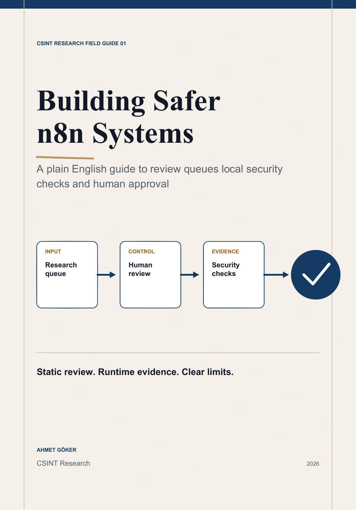
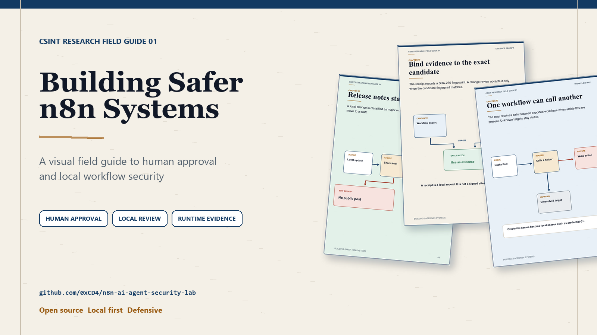
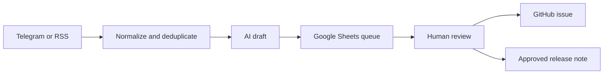
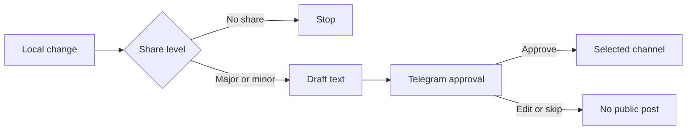
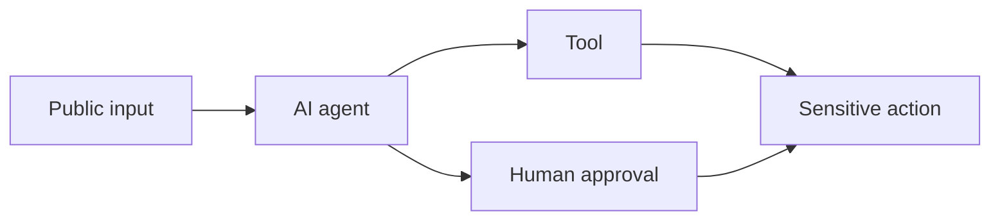
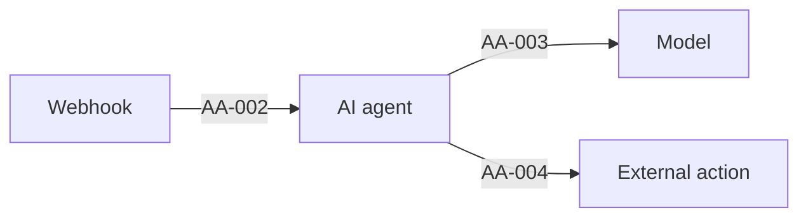
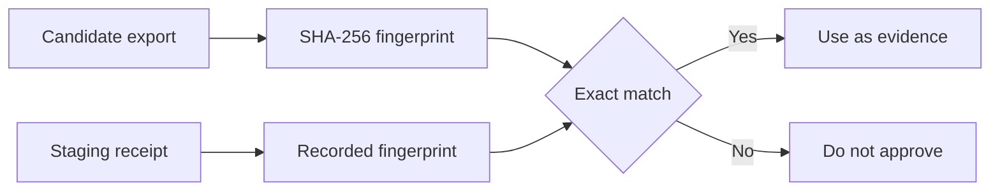
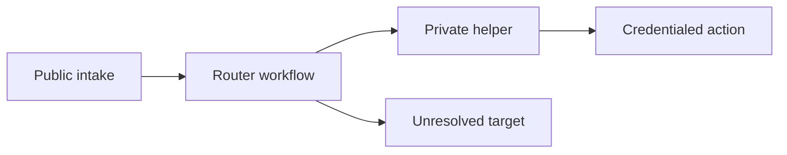

# Building Safer n8n Systems



This is a plain English field guide to the n8n systems I built for CSINT Research.

It starts with a small research queue. It then moves through human review. It ends with local workflow security checks and release evidence.

[Download the designed PDF](n8n-systems-field-guide.pdf)

The web edition is being prepared.

## Share images



- [Book cover](social/01-cover.png)
- [Release approval flow](social/02-release-approval.png)
- [Evidence receipt flow](social/03-evidence-receipt.png)
- [Workflow map](social/04-workflow-map.png)

## Who this book is for

You do not need to be an n8n expert.

You only need to know that an n8n workflow connects small steps called nodes.

The book explains why each system exists. It also shows where a person stays in control.

## The whole system



The queue is not an autopublisher.

AI can suggest a category and a short draft. A person still approves the work.

## 1. The research queue

The first system collects links from Telegram and RSS. It cleans each URL. It removes duplicates. It stores the result in Google Sheets.

This gives each item a clear state.

- New
- In review
- Approved
- Rejected
- Published

The sheet stays the source of truth.

## 2. Human review in Telegram

The owner gets a short review card in Telegram.

The card supports simple actions.

- Approve
- Reject
- Add a note
- Review later

No public action happens before approval.

## 3. Owner relief without losing control

The next workflows sort pending messages and create one daily digest.

Approved items can become structured GitHub issues. Duplicate issue guards stop the same queue item from creating the same work twice.

The coding agent receives a work packet. It prepares a change. It does not publish or deploy by itself.

## 4. Release notes with an approval gate

The release flow decides whether a change is worth sharing.



This system creates drafts first. It never treats a code change as permission to post.

## 5. Why workflow security became the next step

An AI workflow can connect public input to a model. The model can reach a tool. The tool can reach a sensitive action.



The important question is simple.

Can untrusted input reach a powerful action without a clear control?

## 6. Local static review

The scanner reads an exported n8n workflow as data. It does not run the workflow.

It follows visible paths between nodes. It reports review signals such as a public webhook without visible authentication or a model path that reaches an external write action without approval.

The included teaching examples produced these recorded results.

| Example | Recorded result | Meaning |
| --- | ---: | --- |
| Unsafe support agent | 10 out of 100 | Nine review findings |
| Hardened support agent | 93 out of 100 | One medium review item |

The score is a review aid. It is not proof of security.

## 7. Exposure graphs

The scanner can turn risky paths into a small graph.



Finding IDs stay attached to the edges. The same IDs also appear in JSON and SARIF output.

This makes a report easier to read. It also keeps the graph tied to scanner evidence.

## 8. The runtime gate

Static review shows what the export appears to allow. A runtime gate checks how an isolated staging target responds.

The recorded action free fixture passed eight scenarios and fifty six checks. It executed zero external actions.

The checks covered authentication. They also covered input shape and approval bypass. Replay behavior and prompt injection containment were checked too.

No language model was called.

## 9. Fingerprints and receipts

The runtime receipt records a SHA-256 fingerprint for the workflow and the contract.



This stops a receipt from being attached to a different candidate by mistake.

It is still a local record. It is not a signed attestation.

## 10. Workflow change review

The change review compares a baseline export with a candidate export.

It shows new risk. It also shows removed risk and stronger controls. Outbound destinations and credential type changes appear as separate records.

A matching runtime receipt can support the decision. A failed receipt or a fingerprint mismatch cannot approve the candidate.

## 11. Multi workflow maps

A single export may call another workflow. The map tool resolves those calls when stable IDs are present.



The report uses local credential aliases. It does not print exported credential names or IDs.

Unresolved calls stay visible. They do not disappear from the review.

## 12. Public template research

The project also includes a bounded study of one hundred popular free AI Agent templates from the official n8n template API.

The collector downloaded JSON only. It did not import or run a workflow.

Fifty two templates were queued for path level manual review. That number is a scanner signal. It is not a vulnerability count.

## 13. What stays local

Workflow exports stay on the local machine during the scanner workflow.

The scanner does not upload them to an AI API.

Reports omit prompt values and credential values. Public research outputs use aggregate results or redacted aliases.

## 14. Try the lab

Requirements are Node.js 20 or newer.

```bash
npm test
npm run audit
npm run gate:demo
npm run map:demo
```

No npm package installation is required for these commands.

Use only redacted files and isolated systems that you own or are allowed to test.

## What I learned

Small systems are easier to trust when each step has one job.

Human approval should be visible. Safety checks should produce evidence. Unknowns should stay unknown.

The graph is useful because it turns a long workflow into one question.

Where can this input go?

## Project links

- [n8n AI Agent Security Lab](https://github.com/0xCD4/n8n-ai-agent-security-lab)
- [CSINT n8n automation folder](https://github.com/0xCD4/csint-osint-archive/tree/main/automation/n8n)
- [CSINT AI Security workspace](https://en.csintresearch.org/ai-security)

## Safety note

This work is defensive and educational.

Never activate the unsafe teaching workflow. Never attach production credentials to a fixture. Never point the runtime gate at a system without clear authorization.
