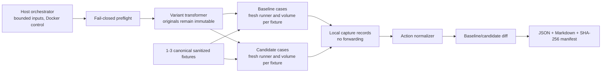

# CSINT Release Rehearsal: security architecture and technical spike

Status: internal feasibility spike; Phases 1-5 evidence recorded; Phase 6 action core implemented and tested

Date: 2026-08-06

Decision: `PASS_ACTION_REHEARSAL_CORE` for the bounded action-level core only; no node-trace or product-release authorization

`CSINT Release Rehearsal` is an internal working name only. It has not been checked as a trademark, is not approved public branding, and must not appear in public copy during this spike.

This document defines a Stage 2 experiment and records the verified Phase 1-6 spike evidence. Proposed capabilities that are not explicitly marked as verified remain unimplemented. Every item marked `UNKNOWN` must be proved before it can be presented as runtime evidence.

## 1. Problem statement

The current lab can inspect exported n8n JSON, compare a baseline with a candidate, apply static risk and trust rules, run a candidate-linked staging contract, and produce fingerprinted evidence. That answers questions about structure and a bounded staging contract.

It does not yet answer the Stage 2 question:

> With the same sanitized fixtures, which supported external actions do the baseline and candidate attempt, and how do those intended actions differ?

The proposed experiment executes one baseline and one candidate in separate disposable rehearsals. It intercepts only supported HTTP Request actions and records attempts at a local capture service. It never forwards those attempts to their original destinations.

An “attempted action” means that the transformed workflow reached the supported HTTP Request node and the local capture service received its request. It is not proof that the original unmodified workflow would complete the same action against a real service. It is also not a production trace, deployment identity, authorization check, or guarantee of safety.

The narrow input limits are:

- exactly one baseline workflow export and one candidate workflow export;
- no more than 20 active nodes in either workflow;
- one to three sanitized JSON fixtures;
- HTTP Request as the only supported external action node;
- `POST`, `PUT`, and `PATCH` as the only supported action methods;
- `DELETE` blocked and unsupported;
- all unknown nodes, node versions, expressions, connection types, and execution paths fail closed.

## 2. Difference from the existing Client Handoff Release Check

The existing offer in `SERVICE.md` is a manual handoff review. It accepts a broader candidate size, reports structural changes and blockers, and can bind existing staging evidence to the candidate fingerprint. This experiment is a narrower runtime-behaviour spike.

| Dimension | Client Handoff Release Check | Proposed Stage 2 spike |
| --- | --- | --- |
| Primary question | What materially changed, and what should a human review before handoff? | Which supported HTTP actions were attempted for identical sanitized fixtures, and how did they differ? |
| Evidence | Static comparison plus an optional candidate-bound staging receipt | Two separate transformed rehearsals plus captured action attempts and a behaviour diff |
| Workflow size | Existing offer: up to 30 active candidate nodes | At most 20 active nodes in each export |
| External actions | Reports node, destination, credential-type, control, and reliability changes | Executes only transformed HTTP Request nodes using `POST`, `PUT`, or `PATCH` |
| Credentials | Reports credential types without values | Rejects every credential reference and never mounts or loads an n8n credential store |
| Output | Existing handoff report | Internal JSON report, Markdown report, and SHA-256 manifest |
| Status | Existing manual service boundary | Verified internal action-level MVP core; not a product release |

Stage 2 must not silently replace the existing review. If it becomes useful, its receipt may later be an additional evidence input to the handoff review. That integration is outside this spike.

## 3. Non-goals

This spike does not:

- connect to production or customer n8n instances;
- use production credentials, an existing n8n volume, an existing database, or an existing Docker container;
- call live AI providers;
- send Gmail, SMTP, Slack, HubSpot, database, payment, or other vendor actions;
- execute Code, Execute Command, community nodes, custom nodes, or arbitrary packages;
- support `DELETE`, `GET`, `HEAD`, `OPTIONS`, non-HTTP protocols, redirects, streaming, binary upload, or multipart upload as action evidence;
- infer that a static graph path executed;
- infer approval from a node name, node type, or graph position;
- prove that a captured destination exists, is owned by the customer, or is authorized;
- prove production deployment identity from an export hash;
- reproduce third-party service behaviour;
- perform penetration testing, compliance certification, or production readiness certification;
- provide a public product name, public copy, pricing change, deployment, or prospect outreach;
- support more than one developer's bounded spike scope.

## 4. Verified reusable implementation points

These references were verified in the current dirty worktree. This list describes available source, not commit or release status.

The following references exist in the current repository. Reuse means reuse of a bounded function or pattern after tests, not wholesale reuse of the current runner.

| Existing reference | Verified useful part | Boundary for this spike |
| --- | --- | --- |
| `src/safe-json.mjs`, `readBoundedJsonFile` | Bounded byte, depth, and value-count parsing; strict UTF-8; non-regular file and symlink rejection; file identity checks around the read | Add the smaller Stage 2 workflow and fixture limits; do not bypass this loader with plain `JSON.parse` |
| `src/workflow-input.mjs`, `validateWorkflowExport` and `readWorkflowFile` | Basic workflow shape, node-name uniqueness, connection-target checks, and configurable node count | Stage 2 needs stricter node IDs, type/version allowlists, connection-type validation, expression policy, and active-node limits |
| `src/evidence-fingerprint.mjs`, `canonicalJson`, `fingerprintJson`, and `buildEvidenceSubject` | Existing canonical JSON SHA-256 convention and evidence-subject shape | Hash originals, fixtures, transformed copies, contracts, and output files separately |
| `src/rules.mjs`, `classifyWorkflowNode`, `workflowAdjacency`, `workflowCredentialReferenceKeys`, and `auditN8nWorkflow` | Existing static classification, adjacency, secret checks, approval heuristics, side-effect classification, and credential reference discovery | Static approval heuristics remain context only. They must never become runtime approval proof |
| `src/multi-workflow.mjs`, `loadWorkflowSet` and `analyzeWorkflowSet` | Existing detection and resolution logic for workflow calls and ambiguous targets | Stage 2 supports one workflow only. Any active subworkflow/tool-workflow call is rejected, even if the target can be resolved |
| `src/target-policy.mjs` | URL parsing, URL-credential rejection, scheme checks, normalization concepts, and exact target-policy tests | Stage 2 never permits an original destination. The capture route is local and fixed |
| `src/runtime-gate.mjs` | Bounded requests, response sizes, redirects, timeouts, static blockers, error sanitization, and explicit result accounting | It runs a security contract against a staging target; it is not an action-capture engine |
| `src/runtime-receipt.mjs` | Candidate and contract evidence subjects, public scenario reduction, limitations, and JSON/Markdown receipt patterns | Add baseline/candidate pairing and do not reuse the current zero-external-action claim |
| `src/dynamic-lab-report.mjs` | Clear distinction between the executed staging fixture, its fingerprint, and a separate static reference | Preserve this evidence boundary in Stage 2 wording |
| `scripts/verify-n8n-staging.mjs` | Disposable names, temporary volume lifecycle, import/publish/start/check/cleanup flow, and cleanup result recording | Replace its default networking and tag-only image selection; do not reuse its published loopback port as an egress control |
| `../../tools/ai-agent-auditor/workflow-change-review.mjs` | Baseline/candidate canonical fingerprints, structural change events, candidate-bound receipt validation, deterministic rendering, and explicit limitations | Stage 2 action evidence is a separate receipt kind. Existing runtime acceptance only understands the current receipt kinds |
| `../../tools/ai-agent-auditor/workflow-change-review-cli.mjs` | Small local CLI and explicit exit-code pattern | Its direct unbounded file reads are not suitable for the new untrusted inputs |
| `../../scripts/test-workflow-change-review.mjs` | Determinism, candidate-binding, blocked dangerous node, and secret-omission test patterns | Add real disposable-container integration tests for this spike |
| `../../components/ai-security/dynamic-lab-playback.ts` | Explicit evidence-boundary comment and candidate fingerprint check | Its highlighted path is a fixture/scenario route projection, not a node execution trace, and cannot prove Stage 2 execution |

The current n8n tag in `scripts/verify-n8n-staging.mjs` is `docker.n8n.io/n8nio/n8n:2.21.5`. The spike may start its compatibility work from that version, but it must select and record an exact digest before running. No digest is asserted in this design because it has not been measured in this task.

## 5. Missing capabilities

The repository does not currently contain the following Stage 2 capabilities:

- a strict Stage 2 contract and fixture schema;
- an exact active-node and `typeVersion` compatibility matrix for a pinned n8n image;
- an expression subset validator;
- an HTTP Request transformer with semantic-conformance evidence;
- a local action capture service;
- a deterministic response-stub service;
- an n8n execution adapter that retrieves real per-run node data through a supported interface;
- a runtime proof that a configured approval node and approved output ran before an action;
- a network profile that prevents both internet and host-gateway access;
- DNS and non-capture connection-attempt observation;
- action occurrence normalization;
- baseline/candidate action matching and diffing;
- a Stage 2 receipt schema and SHA-256 file manifest;
- crash recovery scoped by run labels;
- tests showing that the transformed HTTP node preserves the supported observable fields.

Two items are especially `UNKNOWN`:

1. The exact supported n8n interface and result schema that can return per-run node execution data for a webhook fixture on the selected image.
2. Whether the tested `none` plus shared `container:` network namespace, local resolver, and connection observation work consistently on the supported Docker Desktop/Engine environment.

The spike must prove both. Reading n8n's internal SQLite schema or treating UI playback data as a trace is not an acceptable shortcut.

## 6. Proposed system architecture

### 6.1 High-level shape



The orchestrator is the only component allowed to call the Docker API. No container receives the Docker socket. Original workflows and fixtures are mounted read-only where a container needs them. Generated transformed workflows and per-case state live in a new run directory and new named volumes.

Each `variant × fixture` pair runs as a clean case. With one baseline, one candidate, and three fixtures, the maximum is six cases. A new n8n volume and runner are used for every case so execution state, retry state, static data, and item-linking state cannot leak between cases.

### 6.2 Narrow supported workflow profile

The initial active-node allowlist is deliberately small:

- `n8n-nodes-base.webhook` as the single fixture entry point;
- `n8n-nodes-base.respondToWebhook`;
- `n8n-nodes-base.set`;
- `n8n-nodes-base.if`;
- `n8n-nodes-base.switch`;
- `n8n-nodes-base.merge` only for modes proven by conformance tests;
- `n8n-nodes-base.splitInBatches` only after loop conformance tests;
- `n8n-nodes-base.httpRequest` as the only external action.

The exact `typeVersion` values are `UNKNOWN` until tested against the pinned n8n digest. Implementation must store them in a closed compatibility matrix. “Core node” is not enough: an unlisted type version fails preflight.

Every active node must be on this allowlist. Community and custom node types fail even when their package happens to be installed on the host. Code, Execute Command, AI/model, email, chat, CRM, database, file-system, payment, and subworkflow nodes fail preflight. Disabled Code, Execute Command, community, and custom nodes also fail because importing them adds unnecessary ambiguity. Other disabled built-in nodes are listed as excluded evidence and do not count as executed.

Only `main` connections and the exact output layouts in the compatibility matrix are supported. Error workflows, error outputs, wait/resume execution, queue mode, multiple triggers, form/chat triggers, pinned execution data, and unknown connection structures fail closed.

### 6.3 Action interception

The transformer never edits the original export. It creates a case-specific copy and:

1. keeps the original HTTP Request node ID, name, type, type version, method, body, query, headers, retry options, and item flow;
2. requires a literal `POST`, `PUT`, or `PATCH` method;
3. moves the original URL value or allowed URL expression into a reserved capture metadata field evaluated by the same node;
4. changes only the actual network destination to a fixed local capture URL;
5. adds reserved run, fixture, variant, and node identifiers;
6. rejects any existing header or parameter using the reserved `x-csint-rehearsal-*` prefix;
7. emits an exact transformation manifest with JSON pointers and before/after value hashes;
8. validates the transformed export again before it can enter a container.

The capture service does not resolve, connect to, proxy, or forward the recorded original destination. It returns only the fixture's predetermined sanitized response for that stable node ID and occurrence.

Moving a URL expression into capture metadata may not be semantically identical to n8n evaluating it as a URL. Keeping the built-in node type reduces the difference but does not remove it. The transformer is therefore an experiment, not assumed evidence. Milestone 1 must compare supported fields against a local reference endpoint and reject any expression form that does not produce identical method, evaluated URL, query, selected headers, body bytes, item count, retry count, and output item linking.

### 6.4 Fixture model

Each sanitized fixture contains:

- a unique human-readable fixture ID;
- a webhook request method, path, bounded headers, and bounded JSON body;
- deterministic response stubs keyed by HTTP Request node ID;
- an ordered response sequence for retry or loop occurrences;
- optional expected action ceilings;
- no credentials, tokens, personal data, production identifiers, or external URLs used as live targets.

The same canonical fixture bytes, fixture SHA-256, fixture ID, and correlation ID are used for baseline and candidate. A response sequence is never silently repeated. If the workflow requests an unconfigured occurrence, the capture service returns a fixed failure and the case is `CAPTURE_INCOMPLETE`.

### 6.5 Execution data adapter

The orchestrator imports and publishes the transformed workflow into the case's fresh volume, starts the pinned runner, submits the fixture from inside the contained network namespace, waits for one correlated execution, and retrieves its execution data.

n8n documents workflow import and `n8n execute --id` in its CLI, but the exact supported method for combining webhook fixture injection with complete per-node run data must be proved for the pinned image. The adapter must use a documented or explicitly supported surface. If it cannot retrieve the executed node order, output index, item linkage, retry information, and terminal status without internal database coupling, Milestone 1 is a no-go.

Phase 4 tested the documented CLI boundary against the exact local n8n `2.21.5` image. Import by file and execution by workflow ID exited successfully, and exactly one correlated loopback capture completed. The `--rawOutput` stdout was not strict JSON: at the documented `info` log level, n8n emitted a non-JSON prefix before JSON-looking braced content. The strict parser rejected the complete stream without attempting extraction. Raising the supported log level to `warn` or `error`, or routing logs to a file, also removed the JSON result from stdout. Extracting the braced substring would violate the supported-interface and prefix/suffix rules. The verified adapter result is therefore `EXECUTION_TRACE_UNAVAILABLE`, with no downstream-node, executed-node order, or item-link claim.

Phase 5A tested n8n's documented `export:entities` Server CLI after the same fixed workflow executed once. The command completed and produced bounded workflow, execution, and execution-data members, but those target JSONL members were opaque salted Base64 encryption envelopes rather than standalone JSON records. The documented CLI offers entity import, not a standalone decrypted execution-output command. Phase 5A therefore stopped without implementing a cipher, dependency-internal call, SQLite query, API, or other fallback. Because the artifact could not establish exactly one matching workflow and one matching execution, it cannot support even a partial node-level trace claim. The verified result is `TRACE_EXPORT_UNAVAILABLE`.

The browser playback helper is not an adapter. Its route is a projection derived from a receipt fixture and scenario.

### 6.6 Isolation profile

The tested Phase 3 containment profile uses one disposable network namespace and two runtime roles:

- a disposable capture role that owns the network namespace and runs the HTTP capture listener, local DNS sink, and bounded connection observer;
- a disposable n8n runner that uses the capture container's network namespace with `--network container:<capture-container>`.

The capture role starts with `--network none`. No bridge or other Docker network is created, and no port is published or exposed. The runner shares only the capture role's exact container network namespace, so the capture endpoint is reachable at loopback without adding an internet, LAN, Docker gateway, cloud metadata, or host route.

The generated runner `resolv.conf` points only to the capture role's loopback DNS sink and is mounted read-only. The DNS sink does not forward queries. It records unexpected names and returns a deterministic failure. The capture HTTP listener accepts only the fixed rehearsal route, allowed methods, and complete case correlation; any other HTTP request is recorded and rejected. The connection observer records non-loopback attempts where the platform exposes them. n8n execution errors and missing capture correlations provide a second signal. Any unexpected DNS query, HTTP request, direct connection attempt, or action that does not arrive at the capture listener fails the case.

Phase 3 verified this profile on Docker Engine 29.4.1 in Linux-container mode on `linux/amd64`: both roles had only loopback, neither had a usable IPv4 or IPv6 default route, loopback HTTP capture succeeded, the local DNS sink returned NXDOMAIN without forwarding, and public-test, metadata, private-LAN, and Docker-gateway connection attempts returned `ENETUNREACH`. This tested `none` plus shared `container:` profile replaces the earlier proposed internal bridge for this narrow spike. It does not establish n8n or workflow execution.

`--internal` alone was not selected because Docker documents that the host can communicate with container IPs and containers retain communication with the bridge gateway. If the installed Docker environment cannot enforce the tested `none` plus shared-namespace profile, the run stops with `ISOLATION_UNAVAILABLE`; it must not fall back to an internal or default bridge.

The spike must never describe this setup as “perfectly isolated.” It is a bounded local containment design that trusts the host OS, Docker daemon, pinned images, and capture implementation.

### 6.7 Image and process controls

- Pin the n8n image by repository, version tag, and exact `sha256` digest.
- Pin the capture image by exact digest or build it from reviewed local source and record its image ID plus source hash. A floating base image is not accepted.
- Use `--pull=never` after preflight verifies the locally present digest.
- Run containers without `--privileged` and without the Docker socket.
- Drop all capabilities by default. Add only a narrowly justified capture capability if packet observation requires it; record it in the manifest. If observation requires `NET_ADMIN` or privileged mode, the spike is no-go.
- Use read-only root filesystems where n8n permits, bounded temporary filesystems, a non-root user where supported, memory and CPU limits, a process limit, and a hard case timeout.
- Disable community package installation and task runners that would execute unsupported code.
- Use a new empty n8n home and new volume for every case.
- Never set or mount production environment variables, production credential encryption keys, proxy settings, cloud metadata tokens, SSH agents, browser profiles, or host home directories. Phase 4 uses one fresh synthetic encryption key per disposable run and never retains it in evidence or logs.

Docker image digests identify immutable image content, while tags can move. The exact requested reference, repository digest, image ID, platform, and Docker version belong in the evidence manifest.

## 7. Trust boundaries

| Boundary | Less trusted side | More trusted side | Rule |
| --- | --- | --- | --- |
| File input | Workflow exports and fixtures | Bounded parser/preflight | Treat all fields as hostile data; do not execute before complete validation |
| Original/transformed | Generated rehearsal copy | Immutable original subject | Hash both; never label the transformed hash as the original workflow hash |
| Host/container | n8n workflow execution | Host orchestrator | Only orchestrator controls Docker; no Docker socket or broad host mount in containers |
| Runner/capture | Transformed workflow | Capture service | Capture accepts only the run's fixed metadata and never forwards |
| Capture/report | Raw in-memory request | Public evidence record | Persist normalized fields and hashes, not raw headers or bodies |
| Static/runtime | Graph analysis | Observed execution data | Static reachability cannot establish execution or approval |
| Export/deployment | Export fingerprint | Production deployment | Hash association is not deployment identity |
| Local/remote | Shared `none` namespace | Internet, LAN, Docker gateway, metadata, and host services | Loopback only, no default route, no published port, local DNS sink, inspect checks, and probes |
| Evidence/operator | Generated report | Human release decision | Report records bounded evidence; a person still decides what to do |

The host, Docker daemon, local filesystem, and selected images are trusted computing base. A compromised host or Docker daemon can invalidate the evidence. This limitation must appear in every report.

## 8. Data flow

1. Read the baseline, candidate, fixtures, and optional approval bindings with bounded file handling.
2. Canonicalize and hash the untouched inputs.
3. Validate counts, IDs, schema, nodes, methods, connections, expressions, credentials, secrets, subworkflows, and fixture parity.
4. Run the existing static audit for context. A blocking static finding stops execution.
5. Build stable action identities from workflow node IDs. Do not pair nodes by similar names.
6. Transform each workflow into a clearly labelled rehearsal copy and hash it.
7. Verify every transformation against an allowed JSON-pointer change set.
8. Verify image digests and the Docker isolation features.
9. For each fixture, create a new run directory and volume, then start the capture role with `--network none` and the n8n runner in that exact namespace.
10. Run containment probes before importing any untrusted workflow.
11. Import and publish only the transformed workflow into that case.
12. Inject the exact same canonical fixture into baseline and candidate cases.
13. Capture every supported HTTP action occurrence and return only configured response stubs.
14. Retrieve the correlated n8n execution result and bind capture records to executed node data.
15. Stop the case on timeout, action ceiling, unexpected DNS, unexpected connection, missing trace, missing capture, or unsupported behaviour.
16. Normalize completed baseline and candidate action sets.
17. Diff records by fixture ID, node ID, and occurrence.
18. Write the JSON and Markdown reports atomically.
19. Hash evidence files and write the manifest last.
20. Remove all labelled containers, volumes, networks, and temporary files; record every cleanup result.

No failed or partial case contributes a “no difference” result. The whole comparison is incomplete unless every configured baseline and candidate case reaches a terminal, correlated result and cleanup succeeds.

## 9. Threat model

The model covers accidental and malicious workflow exports within the stated node subset.

| Threat | Example | Control | Residual boundary |
| --- | --- | --- | --- |
| Hidden active action | Candidate adds an HTTP node on a rare branch | All active nodes and connections validated; identical fixtures; observed actions captured per fixture | Fixtures cannot prove untested branches |
| Unsupported execution | Community or Code node performs arbitrary work | Reject node type before Docker; no community packages; task runners disabled | A vulnerability in an allowed node or n8n remains possible |
| Credential leakage | Export references a stored credential or embeds a bearer token | Reject credential objects and secret-like literals; empty home/volume; no host env/mounts | Secret detection is heuristic; sanitized inputs remain an operator duty |
| Network escape | Node connects to internet, LAN, gateway, metadata, or host | Transform allowed actions; shared `none` namespace; no default route; DNS sink; inspect checks; probes; connection observation | Host/Docker compromise is out of scope |
| DNS leakage | Expression resolves an external hostname | Runner resolver points to local non-forwarding sink; any unexpected query fails | Platform resolver behaviour must be proved |
| Transformer ambiguity | Replaced field changes expression or item semantics | Closed expression subset; conformance corpus; transformed hash and exact manifest | Semantic equivalence outside the tested matrix is unknown |
| Duplicate action | Retry or loop sends the same action more than once | Record every occurrence; no deduplication; count diff; action ceiling | Real service retry behaviour is not reproduced |
| Approval overclaim | Graph contains an approval node that did not run | Claim approval only from correlated execution order and output | Exact n8n trace surface is currently unknown |
| Cross-workflow escape | Execute Workflow calls an unreviewed workflow | Reject every active subworkflow/tool-workflow call | None within accepted inputs |
| Evidence substitution | Receipt is attached to another export or fixture | Canonical hashes for originals, transforms, fixtures, config, images, and output files | Hashes do not establish who deployed anything |
| Capture tampering | Capture changes or omits records | Pinned/reviewed capture image; correlation counts; execution-to-capture reconciliation | Local evidence is not a signed third-party attestation |
| Resource exhaustion | Large input, infinite loop, response flood | Input bounds, node limits, fixture limits, timeouts, CPU/memory/PID limits, action ceiling | A denial of the local spike run remains possible |
| Cleanup collision | Recovery deletes unrelated Docker resources | Unique run ID and labels; exact IDs recorded; label-and-owner verification before deletion | Docker daemon errors can leave labelled artifacts |

## 10. Assets to protect

- the user's original baseline and candidate exports;
- sanitized fixtures and any remaining private business data in them;
- the integrity of original, transformed, and evidence hashes;
- the distinction between static evidence, transformed rehearsal evidence, and production state;
- the local workstation, host services, LAN, and internet from workflow-originated traffic;
- Docker resources unrelated to the run;
- the capture service's in-memory request values;
- the correctness and determinism of action counts and diffs;
- the human release decision from misleading “pass” language;
- future customer trust from unsupported claims.

Raw request bodies and header values are transient processing data. They should not enter logs or evidence files. The evidence can retain byte counts, content type, selected structural metadata, and SHA-256 values.

## 11. Actors and abuse cases

### Actors

- a developer comparing their own workflow exports;
- a reviewer running the local spike;
- an accidental author who left a credential, unsupported node, or retry setting in an export;
- a malicious workflow author attempting code execution, network escape, secret access, report confusion, or resource exhaustion;
- a compromised dependency, image, local Docker daemon, or host;
- a later reader who may overinterpret a hash or “passed” result.

### Abuse cases

- use an expression to construct an external URL that bypasses a literal-host check;
- place an action behind an untested branch and treat its absence as proof it cannot run;
- rename a node to look like an approval without executing an approval output;
- replace an HTTP action node ID so a destination change is hidden by heuristic pairing;
- configure retries or loops to produce duplicate actions;
- use a subworkflow, error workflow, or unknown connection type as an escape path;
- smuggle a token in a header, body, query parameter, node parameter, fixture, or environment expression;
- use DNS as an outbound channel even when TCP routing is blocked;
- target the Docker bridge gateway or a host service;
- make the capture endpoint redirect to the original destination;
- induce a timeout and interpret missing records as zero actions;
- substitute a transformed workflow hash for the original candidate hash;
- present a fixture-derived browser route as a runtime trace;
- crash the process so temporary Docker resources remain.

Every abuse case above must either have an automated rejection test or remain an explicit no-go item.

## 12. Security invariants

1. Original workflow and fixture bytes are never modified.
2. Baseline and candidate use byte-identical canonical fixtures and stable fixture/correlation IDs.
3. No case starts until the complete preflight passes.
4. Every active node type and type version is explicitly allowed.
5. The only supported external action is the built-in HTTP Request node using a literal `POST`, `PUT`, or `PATCH` method.
6. `DELETE` always returns `METHOD_UNSUPPORTED` before a runner starts.
7. Any credential reference, secret-like literal, environment secret reference, or reserved metadata collision blocks the run.
8. No workflow container sees an existing n8n home, volume, credential store, host home, Docker socket, or production environment.
9. Original destinations are data only. The capture service never resolves or forwards them.
10. A captured record is accepted only when its run, variant, fixture, node, execution, and occurrence correlation all match.
11. Every occurrence is retained. Retries and loops are never deduplicated.
12. No captured record plus no complete trace means `UNKNOWN`, not zero actions.
13. Approval is “observed” only when correlated runtime data shows the configured approval node and approved output before the action occurrence.
14. Static reachability and browser route projection never become execution evidence.
15. An internal network and loopback port publication are not assumed egress controls; isolation probes must pass.
16. Unexpected DNS or non-capture connection activity blocks the case.
17. Original, transformed, fixture, image, contract, and output hashes are labelled separately.
18. An export hash proves association with bytes supplied to the tool, not production deployment identity.
19. All configured cases must complete and clean up before the report can have status `completed`.
20. Any unsupported or uncertain behaviour produces a non-zero exit and no approval decision.

## 13. Fail-closed rules

The preflight returns one of `accepted`, `unsupported`, or `blocked`. Runtime returns `completed` or `failed`. Only `completed` cases enter the diff.

Block before execution when:

- either workflow is missing, unreadable, not a regular file, a symlink, malformed, oversized, or over the node limit;
- the fixture count is outside one to three, IDs repeat, or baseline/candidate would receive different fixture hashes;
- any active node, node version, connection type, expression form, or execution mode is outside the closed matrix;
- any action method is not literal `POST`, `PUT`, or `PATCH`;
- an action URL is not an allowed literal or expression form;
- a URL contains user information, a non-HTTP scheme, or cannot be normalized;
- a credential reference or secret-like value is present;
- any subworkflow, tool-workflow, Code, Execute Command, AI/model, community, custom, email, chat, CRM, database, file-system, or payment node is present in an executable position;
- an action node lacks a stable unique node ID;
- a reserved capture field already exists;
- the transformation changes a field outside the exact allowed pointer set;
- the image digest, platform, Docker feature, network membership, DNS sink, containment probe, or connection observer is not as required.

Fail the case during execution when:

- an unexpected DNS query or connection attempt occurs;
- a capture request has an invalid correlation or duplicate occurrence index;
- an action has no configured fixture response;
- the action ceiling, response-size ceiling, memory limit, or timeout is reached;
- a redirect is requested;
- execution data is missing, incomplete, ambiguous, or cannot be correlated;
- a capture record lacks a matching executed HTTP node;
- an executed HTTP node lacks a matching capture record;
- a configured approval claim cannot be proved;
- cleanup is incomplete.

The Markdown report must use “unsupported,” “blocked,” “failed,” “incomplete,” or “unknown” precisely. It must never turn them into “no change.”

## 14. Preflight checks

Preflight order is fixed so untrusted inputs are rejected before expensive or stateful work:

1. Resolve exact input paths without following symlinks.
2. Read through `readBoundedJsonFile` with Stage 2 byte, depth, and value ceilings.
3. Require exactly one baseline, one candidate, and one to three fixtures.
4. Canonicalize and hash all untouched inputs.
5. Validate workflow shape and require no more than 20 active nodes per workflow.
6. Require stable, non-empty, unique node IDs and unique names.
7. Require exactly one supported webhook trigger and only supported connection types.
8. Validate every node type and `typeVersion` against the pinned compatibility matrix.
9. Reject active and high-risk disabled nodes listed in the fail-closed rules.
10. Reject every active subworkflow or tool-workflow call, including dynamically selected targets.
11. Validate the expression abstract syntax or restricted token form. Reject dynamic code, environment, credential, variable, file, network, and unsupported item-link references.
12. Require literal action methods and validate original URL values/expressions without resolving hostnames.
13. Search workflow and fixture values for credential references, reserved fields, and secret-like literals. Redact the error value.
14. Validate response stubs, occurrence ceilings, body sizes, and deterministic ordering.
15. Validate optional approval bindings against exact node IDs and output indexes.
16. Run the existing static audit. Any critical blocker prevents runtime.
17. Transform both workflows, revalidate them, and verify the allowed JSON-pointer delta.
18. Compute transformed fingerprints and the transformation-manifest fingerprint.
19. Verify Docker version, platform, image repository digests, local-only image availability, and required run flags.
20. Create labelled capture and probe roles using `none` plus `container:<exact-capture-id>`, then verify exact network modes, loopback-only interfaces, no usable default route, no published ports, resolver configuration, capture reachability, host-gateway denial, public-IP denial, and local DNS-sink receipt.
21. Destroy the probe resources and verify their removal.

Only then may the first workflow case be created.

## 15. Execution lifecycle

For each fixture, run baseline first and candidate second. This order is recorded but does not share state.

1. Generate a cryptographically random run ID and deterministic case ID.
2. Create a private case directory with restrictive permissions.
3. Create a uniquely named, labelled n8n volume.
4. Start the pinned capture role with `--network none` and the fixture response table mounted read-only.
5. Verify the capture role has only loopback, no usable default route, no published port, and no unapproved attachment.
6. Start a setup container with `--network none` to import the transformed workflow into the new volume, then remove it.
7. Start the n8n runner in the capture role's network namespace with no published ports.
8. Inspect both containers and their exact network modes. Abort on any extra attachment, mount, environment source, port, capability, or image mismatch.
9. Wait for n8n readiness from within the shared namespace.
10. Publish the imported workflow only if required by the selected documented execution path.
11. Submit the fixture from the capture role to n8n loopback.
12. Correlate exactly one n8n execution ID to the case.
13. Record capture occurrences and serve deterministic stub responses.
14. Retrieve terminal execution data and reconcile executed HTTP nodes with capture occurrences.
15. Stop on the first containment or integrity violation.
16. Normalize the case record without raw secret-bearing values.
17. Stop and remove runner, setup container if present, capture role, volume, and private temporary files.
18. Verify removal by exact ID and label before continuing.

The orchestrator does not run baseline and candidate concurrently. Sequential cases make logs, resource ceilings, and correlation easier to audit and prevent accidental shared state.

## 16. Intended-action schema

One record represents one observed capture occurrence. It does not represent a successful external side effect.

```json
{
  "schemaVersion": 1,
  "actionId": "fixture-id:node-id:0001",
  "runId": "random run identifier",
  "caseId": "deterministic case identifier",
  "variant": "baseline",
  "fixture": {
    "id": "invoice-approved",
    "canonicalSha256": "64 lowercase hexadecimal characters",
    "correlationId": "same value for baseline and candidate"
  },
  "workflow": {
    "originalCanonicalSha256": "64 lowercase hexadecimal characters",
    "transformedCanonicalSha256": "64 lowercase hexadecimal characters"
  },
  "execution": {
    "id": "local n8n execution identifier",
    "nodeId": "stable exported node identifier",
    "nodeName": "HTTP Request",
    "occurrence": 1,
    "attempt": 1
  },
  "intent": {
    "kind": "http",
    "method": "POST",
    "destination": {
      "scheme": "https",
      "host": "api.example.invalid",
      "port": null,
      "path": "/v1/items",
      "queryNames": ["mode"],
      "canonical": "https://api.example.invalid/v1/items?mode=...",
      "canonicalSha256": "64 lowercase hexadecimal characters"
    },
    "headers": {
      "names": ["content-type"],
      "valueSetSha256": "64 lowercase hexadecimal characters"
    },
    "body": {
      "contentType": "application/json",
      "bytes": 123,
      "sha256": "64 lowercase hexadecimal characters",
      "jsonShapeSha256": "64 lowercase hexadecimal characters"
    }
  },
  "capture": {
    "received": true,
    "forwarded": false,
    "responseStubIndex": 0,
    "responseStatus": 200
  },
  "approval": {
    "status": "observed",
    "nodeId": "approval-node-id",
    "outputIndex": 0,
    "observedBeforeAction": true,
    "source": "correlated n8n execution data"
  }
}
```

Normalization rules:

- uppercase the method;
- lowercase scheme and DNS host;
- convert an internationalized hostname to its ASCII form using one documented implementation;
- remove the default port, preserve a non-default port;
- normalize an empty path to `/`;
- remove the fragment because HTTP does not transmit it, while recording that one was present as a preflight warning or rejecting it;
- preserve duplicate query occurrences for counting, but expose sorted query names and a canonical multiset hash rather than raw sensitive values;
- never resolve the original hostname;
- store header names in lowercase and hash the ordered normalized name/value set; never persist authorization, cookie, or raw header values;
- hash exact captured body bytes and a canonical JSON shape when the body is JSON; never persist the raw body;
- assign occurrence indexes in capture receive order within `fixture + node ID`;
- do not deduplicate retries or loop iterations;
- use UTC timestamps only as operational metadata, never as action identity;
- use `approval.status = not_configured` when no approval claim was configured;
- use `approval.status = unknown` if the trace cannot support the claim, and fail that case if approval evidence was required.

Literal examples in this schema use `.invalid` and placeholder hashes. They are not live targets or generated evidence.

## 17. Behavioral-diff schema

The diff matches by exact `fixture.id + nodeId + occurrence`. It never guesses that similarly named nodes are the same.

- A node ID present only in the candidate produces `new_action` records.
- A node ID present only in the baseline produces `removed_action` records.
- A replaced node with a new ID is represented as removed plus new.
- A shared node ID and occurrence can produce `destination_changed` and/or `method_changed`.
- Different total occurrences for the same fixture and node produce `action_count_changed`.
- Multiple change kinds may apply to one paired occurrence.
- Payload hashes may be recorded as supporting evidence, but payload-change classification is outside the required Stage 2 decision.

```json
{
  "schemaVersion": 1,
  "fixtureId": "invoice-approved",
  "nodeId": "stable-node-id",
  "occurrence": 1,
  "changeKinds": [
    "destination_changed",
    "method_changed"
  ],
  "baselineActionId": "invoice-approved:stable-node-id:0001",
  "candidateActionId": "invoice-approved:stable-node-id:0001",
  "before": {
    "method": "POST",
    "destinationCanonicalSha256": "64 lowercase hexadecimal characters"
  },
  "after": {
    "method": "PATCH",
    "destinationCanonicalSha256": "64 lowercase hexadecimal characters"
  },
  "evidence": {
    "fixtureCanonicalSha256": "64 lowercase hexadecimal characters",
    "baselineOriginalCanonicalSha256": "64 lowercase hexadecimal characters",
    "candidateOriginalCanonicalSha256": "64 lowercase hexadecimal characters"
  }
}
```

The report summary contains exact counts for:

- baseline attempted actions;
- candidate attempted actions;
- new actions;
- removed actions;
- destination changes;
- method changes;
- action-count changes;
- cases completed, blocked, failed, unsupported, and unknown.

If either side is incomplete, the diff status is `incomplete`. It must not emit a zero count as evidence of equivalence.

## 18. Evidence bundle

The requested output bundle contains:

- `release-rehearsal.json`: machine-readable subjects, environment, preflight, cases, normalized actions, diffs, errors, cleanup, and limitations;
- `release-rehearsal.md`: restrained human-readable summary with the same counts and boundaries;
- `manifest.sha256.json`: file paths, byte sizes, SHA-256 values, image identities, schema versions, and run identity.

The JSON report separates:

- `subjects.original.baseline`;
- `subjects.original.candidate`;
- `subjects.transformed.baseline`;
- `subjects.transformed.candidate`;
- `subjects.fixtures[]`;
- `subjects.contract`;
- `environment.images[]`;
- `environment.isolation`;
- `evidence.cases[]`;
- `evidence.actions[]`;
- `evidence.diffs[]`;
- `cleanup`;
- `limitations[]`.

The manifest is written last after both reports are flushed and re-read. Reports are written to temporary files and atomically renamed. The manifest cannot include its own hash; the tool may print the manifest SHA-256 to stdout or write a separate sidecar in a later design, but that is not required for this spike.

Required report language:

- “Executed transformed rehearsal” for each runtime subject;
- “Original exported baseline/candidate” for source subjects;
- “Attempted local capture action” rather than “external action executed”;
- “No forwarding configured or observed” rather than “could not reach the internet” unless probes passed;
- “Export fingerprint association, not deployment identity”;
- “Observed approval” only with the runtime condition in Section 12;
- “Bounded local rehearsal, not a production trace or security guarantee.”

The bundle omits raw workflow parameters, prompt text, fixture bodies, request bodies, query values, header values, credentials, environment values, and response bodies. Source paths are reduced to safe labels unless the operator explicitly requests local absolute paths.

## 19. Error taxonomy

| Code | Class | Meaning |
| --- | --- | --- |
| `INPUT_INVALID` | blocked | Missing, malformed, duplicate, or structurally invalid input |
| `INPUT_LIMIT_EXCEEDED` | blocked | File, depth, value, fixture, node, body, or response limit exceeded |
| `UNSAFE_FILE_TYPE` | blocked | Symlink, directory, device, or other non-regular input |
| `NODE_UNSUPPORTED` | unsupported | Node type is outside the closed matrix |
| `NODE_VERSION_UNSUPPORTED` | unsupported | Node type version lacks conformance evidence |
| `METHOD_UNSUPPORTED` | unsupported | Action method is not literal POST, PUT, or PATCH; includes DELETE |
| `CREDENTIAL_REFERENCE_PRESENT` | blocked | A workflow node references an n8n credential |
| `SECRET_LIKE_LITERAL` | blocked | A likely token, password, private key, cookie, or authorization value was found |
| `SUBWORKFLOW_UNSUPPORTED` | unsupported | Workflow or tool-workflow execution can leave the reviewed export |
| `PATH_UNSUPPORTED` | unsupported | Trigger, connection type, error path, wait/resume, or branch form is outside the matrix |
| `EXPRESSION_UNSUPPORTED` | unsupported | Expression cannot be validated within the closed subset |
| `RESERVED_FIELD_COLLISION` | blocked | Input already uses capture metadata reserved by the transformer |
| `TRANSFORM_INVALID` | failed | Transformed copy changed an unapproved field or failed revalidation |
| `IMAGE_DIGEST_MISMATCH` | blocked | Local image identity differs from the configured digest |
| `ISOLATION_UNAVAILABLE` | blocked | Required Docker network or process controls are unsupported |
| `NETWORK_MEMBERSHIP_INVALID` | failed | A container has an unexpected network, port, route, or peer |
| `DNS_ATTEMPT_DETECTED` | failed | Workflow caused an unexpected DNS query |
| `HTTP_ATTEMPT_UNEXPECTED` | failed | Capture received an unrecognized route, method, host, or correlation |
| `EGRESS_ATTEMPT_DETECTED` | failed | Workflow attempted a non-capture connection |
| `EXECUTION_TIMEOUT` | failed | Case did not reach a bounded terminal state |
| `ACTION_LIMIT_EXCEEDED` | failed | Retry or loop produced more occurrences than allowed |
| `TRACE_UNAVAILABLE` | failed | Complete correlated per-node execution data is unavailable |
| `APPROVAL_UNPROVEN` | failed | A configured approval claim was not observed before the action |
| `CAPTURE_INCOMPLETE` | failed | Executed HTTP nodes and capture records do not reconcile |
| `DIFF_AMBIGUOUS` | failed | Stable identity or occurrence data cannot support an exact diff |
| `CLEANUP_FAILED` | failed | One or more exact labelled resources remain |
| `INTERNAL_ERROR` | failed | Unexpected orchestrator or capture failure |

Errors contain the code, safe phase, variant, fixture ID, node ID where known, and redacted message. They do not contain raw parameter values, URLs with query values, headers, bodies, credentials, or environment values.

Suggested process exit codes:

- `0`: all cases completed, evidence written, cleanup verified;
- `2`: unsupported input or capability;
- `3`: policy blocked before execution;
- `4`: runtime, containment, trace, capture, diff, or cleanup failure;
- `1`: usage or unexpected internal error.

## 20. Cleanup and crash recovery

Every Docker resource receives:

- `com.csint.release-rehearsal=true`;
- `com.csint.release-rehearsal.run-id=<run-id>`;
- `com.csint.release-rehearsal.case-id=<case-id>`;
- `com.csint.release-rehearsal.owner=<locally generated owner-id>`;
- a creation timestamp.

The orchestrator stores exact container, volume, network, image, process, and directory identifiers before moving to the next lifecycle step. Cleanup uses those exact identifiers. It never removes resources by a broad name prefix or unvalidated environment variable.

Normal cleanup runs in `finally` and handles process exit, interrupt, and termination signals. It stops the runner first, then the capture role, removes setup containers, removes the volume, removes the network, and removes the private case directory. Each result is independently recorded and verified by inspect.

After a hard crash, the next invocation performs a read-only stale-resource scan. Recovery may remove a resource only when:

1. every required label is present;
2. owner ID matches the local state record;
3. exact resource ID appears in that record;
4. its age exceeds a configured grace period;
5. no matching orchestrator process is alive;
6. the resolved temporary path is inside the dedicated rehearsal state directory.

If any check is uncertain, recovery reports the resource and leaves it untouched. It prints exact manual inspection commands but does not broaden deletion.

If cleanup fails, the reports remain available with `status: failed` and `CLEANUP_FAILED`. The tool must not claim a completed rehearsal.

## 21. Test strategy

### 21.1 Pure unit tests

- canonical input and output hashing;
- action URL normalization, default ports, path, duplicate query names, and IDN handling;
- action occurrence identity and stable ordering;
- each diff category and combinations;
- raw-value omission and error redaction;
- manifest file ordering and hashes;
- error-class to exit-code mapping;
- deterministic reports for fixed inputs, run metadata, and timestamps.

### 21.2 Preflight rejection tests

- 21 active nodes;
- four fixtures;
- duplicate or missing node IDs;
- `DELETE` and every method outside POST/PUT/PATCH;
- dynamic method expression;
- URL credentials, unsupported scheme, and malformed URL;
- credential reference on any active node;
- embedded bearer token, cookie, private key, and password-like value;
- Code, Execute Command, AI, Gmail, SMTP, Slack, HubSpot, database, payment, community, and custom nodes;
- active Execute Workflow with literal, expression, missing, ambiguous, and resolvable targets;
- multiple triggers, unsupported connection type, error workflow, wait/resume, and unknown node version;
- reserved capture-header collision;
- symlink, non-regular file, oversized JSON, excess depth, and excess values.

### 21.3 Transformer conformance tests

For each supported HTTP Request `typeVersion`, compare an unmodified workflow pointed at a disposable local reference endpoint with its transformed workflow pointed at capture. Assert equality of:

- evaluated original destination;
- method;
- query occurrence order and values in memory;
- selected header names and values in memory;
- exact body bytes;
- content type;
- number of input items;
- number and order of requests;
- retry attempts;
- returned item count and paired-item links;
- downstream IF/Switch results.

Cover literal and allowed dynamic URLs, JSON body expressions, multiple input items, one supported loop, retry after a deterministic 500 response, and response-driven branching. Persist only hashes in golden evidence.

Any mismatch removes that expression form, option, node version, or control node from the compatibility matrix. The test must not normalize away a real semantic difference.

### 21.4 Runtime integration tests

- fresh volume and run state for every case;
- exact pinned image and `--pull=never`;
- capture reachable on loopback without a published port;
- external IP connection fails;
- Docker gateway/host service connection fails;
- external DNS request reaches only the local sink and fails the case;
- capture never forwards or redirects;
- a missing fixture response fails rather than repeats;
- every executed HTTP node reconciles with one or more capture occurrences;
- retries and loops create separate records and count changes;
- action ceiling and timeout terminate the case;
- baseline and candidate receive the exact same fixture hash and correlation ID;
- a configured approval's approved output is observed before an action;
- a graph-only or bypassed approval is not reported as observed;
- setup, success, policy failure, runtime failure, interrupt, and forced capture exit all clean up exact resources.

### 21.5 Adversarial tests

- expression-generated destination and query values;
- direct IP destination, IPv6 literal, localhost, Docker gateway-like address, and cloud metadata-like address as original intent data;
- attempts to use proxy environment variables;
- original destination containing newline or header-injection characters;
- duplicate reserved metadata;
- malformed capture correlation;
- out-of-order or duplicate occurrence;
- workflow timeout after one captured attempt;
- report injection through node names and fixture IDs;
- deliberate capture log truncation;
- stale labelled resources mixed with unrelated Docker resources.

### 21.6 Existing regression suite

The nested repository's full `npm test` suite remains required. Stage 2 tests are additive. `git diff --check` must pass. No implementation milestone is complete while an unrelated existing test is failing.

## 22. Exact acceptance criteria

Milestone 1 is accepted only when all of the following are demonstrated on the declared supported host:

1. One baseline and one candidate with at most 20 active nodes each are accepted; 21 nodes are rejected.
2. One, two, and three sanitized fixtures work; zero and four are rejected.
3. The exact same canonical fixture hash and correlation ID appear in both variants for every fixture.
4. Only the closed node/type-version matrix can run.
5. Code, Execute Command, community, custom, AI/model, email, chat, CRM, database, payment, file-system, and subworkflow execution are rejected before Docker starts.
6. Any n8n credential reference or secret-like literal blocks execution.
7. `POST`, `PUT`, and `PATCH` each produce a correlated local capture record.
8. `DELETE` and all other action methods fail with `METHOD_UNSUPPORTED` before Docker starts.
9. The original workflow hashes remain stable before and after the run.
10. Every transformed hash differs when an action destination is rewritten, and the exact transformation manifest explains the difference.
11. At least one literal URL case and each allowed expression form pass the semantic-conformance assertions in Section 21.3.
12. If one conformance assertion fails, that form is unsupported and cannot produce a completed report.
13. The n8n adapter retrieves complete correlated node order, output index, item-linking data, retry data, and terminal status through a supported interface.
14. No report uses the browser playback route projection as execution evidence.
15. A configured approval is reported as observed only when its approved output executed before the captured action.
16. An approval node present in the graph but absent from the executed path is reported as not observed.
17. A loop or retry produces one record per attempt and an exact action count.
18. New, removed, destination-changed, method-changed, and action-count-changed fixtures each produce the expected exact diff kind.
19. A replaced action node ID is represented as removed plus new, not heuristically paired.
20. A missing or extra capture record makes the case incomplete.
21. The capture endpoint is reachable from the runner without a published host port.
22. The runtime namespace has no usable route to the internet, LAN, or host gateway under the declared platform.
23. External DNS is sent only to the local non-forwarding sink, recorded, and causes failure.
24. An unexpected direct connection is blocked and reported by at least one independent signal.
25. Network inspect shows no unapproved network attachment or peer.
26. The n8n and capture images match configured immutable digests, and the manifest records image IDs, digests, and platform.
27. No existing n8n instance, volume, credentials, environment, browser profile, host home, or Docker socket is mounted or used.
28. Evidence files contain no raw fixture body, HTTP body, query value, header value, credential, token, or environment value.
29. The JSON and Markdown reports agree on all statuses and counts.
30. The manifest hashes match re-read report bytes.
31. Two runs with fixed logical inputs and normalized metadata produce identical evidence content where determinism is promised.
32. Success, rejection, timeout, interrupt, capture crash, and runner crash remove only their exact labelled resources.
33. A cleanup failure changes the overall result to failed and identifies remaining exact resource IDs.
34. The complete nested `npm test` suite passes before and after implementation.
35. `git diff --check` passes and the implementation diff contains only approved spike files.

Failure of criteria 11, 13, 22, 23, or 24 is a technical no-go. Those criteria protect semantic fidelity, executed-path evidence, and containment.

## 23. Proposed implementation files

This section is a file plan only. None of these files are created by this design task.

| Proposed file | Responsibility |
| --- | --- |
| `src/release-rehearsal-schema.mjs` | Strict contract, fixture, action, diff, and receipt schemas plus limits |
| `src/release-rehearsal-preflight.mjs` | Bounded validation, closed node/version matrix, credential/secret checks, expression policy, and static blockers |
| `src/release-rehearsal-transform.mjs` | Immutable HTTP Request transformation and exact JSON-pointer manifest |
| `src/release-rehearsal-normalize.mjs` | Destination, header, body, occurrence, and approval normalization |
| `src/release-rehearsal-diff.mjs` | Exact node-ID/occurrence pairing and required diff categories |
| `src/release-rehearsal-receipt.mjs` | JSON/Markdown rendering, evidence boundaries, redaction, and file manifest |
| `src/release-rehearsal-n8n.mjs` | Version-pinned import, fixture trigger, and supported execution-data adapter |
| `src/release-rehearsal-docker.mjs` | Exact labelled lifecycle, image verification, isolation inspect/probes, cleanup, and recovery |
| `scripts/run-release-rehearsal.mjs` | Local orchestration entry point |
| `bin/release-rehearsal.mjs` | Small CLI argument and exit-code layer |
| `lab/release-rehearsal-capture/Containerfile` | Minimal pinned capture image |
| `lab/release-rehearsal-capture/server.mjs` | HTTP capture, deterministic response stubs, DNS sink, bounded observer, and redacted event output |
| `test/release-rehearsal-unit.test.mjs` | Schema, normalization, diff, redaction, determinism, and manifest tests |
| `test/release-rehearsal-preflight.test.mjs` | Complete fail-closed matrix |
| `test/release-rehearsal-transform.test.mjs` | HTTP node and item-link semantic-conformance corpus |
| `test/release-rehearsal-docker.test.mjs` | Disposable integration, containment, trace, correlation, and cleanup tests |
| `fixtures/release-rehearsal/` | Synthetic workflows and sanitized fixtures used only by tests |

`package.json` would receive one local script only after the entry point exists and tests pass. Existing production/report files should not be repurposed to hide the different evidence model.

One developer can own this spike if the allowlist remains closed and Milestone 1 stops at the first no-go. Supporting AI nodes, arbitrary credentials, third-party sandboxes, production instances, or multiple workflow graphs is a separate project.

## 24. Staged product strategy

### Milestone 1: internal feasibility spike

Purpose: answer the two `UNKNOWN` questions and prove or reject the smallest HTTP-only architecture.

Deliverables:

- closed compatibility matrix for one pinned n8n digest;
- one working literal HTTP action path and a bounded expression subset;
- real per-node execution data or a documented no-go;
- containment and DNS/connection probe evidence on the declared Docker platform;
- exact action and diff schemas;
- all acceptance tests relevant to the internal spike.

Exit: internal evidence only. Do not publish, sell, deploy, or add public copy. If trace fidelity, transformation fidelity, or containment fails, record no-go and stop.

### Milestone 2: manual paid pilot

Entry requires all Milestone 1 hard gates, a written manual operating checklist, and a customer-provided sanitized workflow that fits the exact compatibility matrix.

The operator runs the tool locally, reviews every preflight and evidence boundary, and delivers the result manually. No self-service upload, credential connection, or production access is added. The internal working name is not treated as customer-facing branding.

The pilot must record real payment evidence, actual operator time, unsupported workflow causes, customer questions, and whether the action diff affected a release decision. A free demonstration, survey response, social reaction, or verbal interest is not payment evidence.

### Milestone 3: productization only after payment evidence

Do not start product work until at least one completed paid pilot provides payment evidence and the manual run shows a repeatable useful decision. Payment alone is necessary but not sufficient.

Before any broader product decision, review:

- how often real workflows fit the allowlist;
- whether unsupported AI/model paths make the result too narrow;
- operator time and failure rate;
- transformation and trace maintenance across n8n versions;
- whether customers understand export hash versus deployment identity;
- legal, privacy, retention, branding, and support requirements;
- whether isolation needs a dedicated Linux environment rather than general Docker Desktop support.

Self-service upload, multi-tenant execution, hosted capture, credential use, production connectivity, broad node support, automated approval, and public claims all require separate threat models and are outside this architecture.

## 25. Go/no-go recommendation

Recommendation: **conditional go for Milestone 1 only**.

The design is technically plausible for a small class of credential-free, HTTP-centric workflows. Existing bounded loaders, canonical fingerprints, static analysis, receipt patterns, and disposable Docker lifecycle reduce the amount of new work.

The feasibility is not yet established for a reliable Stage 2 result. The three largest risks are:

1. **Transformation fidelity.** Moving the original URL into capture metadata can change n8n expression, request, retry, or item-link semantics. The closed conformance matrix must prove the supported subset.
2. **Executed-path evidence.** The repository has static graph paths and a browser route projection, but not a proven supported interface for complete per-node webhook execution data. Without that data, action correlation and approval observation are not defensible.
3. **Containment portability.** Phase 3 proved `--network none` plus an exact shared `container:` namespace, local non-forwarding DNS, and unprivileged loopback capture on the declared Docker Engine 29.4.1 `linux/amd64` host. Other Docker environments still require the same fail-closed probes, and n8n execution in this namespace remains unproved.

Go to a manual paid pilot only if all hard acceptance gates pass and the supported subset fits an actual sanitized customer case. Go to broader product work only after payment evidence and repeatable usefulness.

No-go Milestone 1 if any of the following remains true:

- the transformer cannot preserve the supported observable HTTP and item-link semantics;
- complete executed-node data requires undocumented database coupling;
- approval cannot be tied to an executed output before an action;
- the Docker platform cannot block and detect host, internet, and DNS attempts as specified;
- packet observation requires privileged mode or broad host capabilities;
- raw sensitive request values cannot be kept out of evidence and logs;
- the practical allowlist excludes the workflows the experiment is meant to evaluate.

Primary technical references used for assumptions:

- Docker documents that the `none` driver isolates a container from host and other-container networking, leaving only loopback: [none network driver](https://docs.docker.com/engine/network/drivers/none/).
- Docker documents `container:<name|id>` network namespace sharing and the options, including `--dns`, that are unsupported in that mode: [container networking](https://docs.docker.com/engine/network/).
- Docker documents that `--internal` networks lack a default route but still allow gateway and host communication: [docker network create](https://docs.docker.com/reference/cli/docker/network/create/#network-internal-mode---internal).
- Docker documents immutable image identity by digest: [image digests](https://docs.docker.com/dhi/explore/security-concepts/digests/).
- n8n documents local CLI workflow import and execution commands: [n8n CLI commands](https://docs.n8n.io/deploy/host-n8n/configure-n8n/use-the-command-line/).
- n8n documents that correct item linking is required for expressions that reference earlier items: [item linking for node builders](https://docs.n8n.io/data/data-mapping/data-item-linking/item-linking-node-building/).

These sources support the design constraints. They do not prove that the proposed implementation works. The acceptance tests above provide that gate.

## 26. Phase 4 verified CLI-adapter result

Phase 4 used only one fixed credential-free workflow:

1. `CSINT Manual Trigger` (`n8n-nodes-base.manualTrigger`).
2. `CSINT Synthetic Input` (`n8n-nodes-base.set`) with bounded fake data.
3. `CSINT Loopback Capture` (`n8n-nodes-base.httpRequest`, type version `4.2`) with a literal `POST` to `127.0.0.1:18080`, exact reserved correlation headers, no credentials, and redirects disabled.
4. `CSINT Downstream Proof` (`n8n-nodes-base.set`) after the capture response.

The local n8n identity was re-resolved before execution:

- requested tag: `docker.n8n.io/n8nio/n8n:2.21.5`;
- repository digest: `docker.n8n.io/n8nio/n8n@sha256:34df96d9a7e14c21c70dea69dc2d9c62f920ffe56238f03861ce5ea4ba56481e`;
- image ID: `sha256:34df96d9a7e14c21c70dea69dc2d9c62f920ffe56238f03861ce5ea4ba56481e`;
- platform: `linux/amd64`.

The pinned image exposed workflow import by file, execution by exact workflow ID, and the `--rawOutput` option. The four-case integration suite then verified:

- successful import and CLI execution of the fixed workflow;
- exactly one accepted `POST` capture with matching run, case, variant, fixture, correlation, workflow fingerprint, and HTTP node ID;
- successful workflow-process exit after the accepted capture, without claiming downstream-node trace evidence;
- capture `COMPLETE`, `forwarded: false`, zero DNS queries, and no containment violation;
- import-failure, execution-timeout, and capture-mismatch cleanup paths;
- exact labelled removal of setup, runner, capture, disposable volume, local capture image, and private run directory;
- unchanged unrelated Docker container, image, volume, and network inventory;
- no retained raw item values, request/response bodies, headers, stdout, stderr, or encryption-key value in normalized evidence.

The execution-data gate did not pass. The complete documented CLI stdout was not a standalone JSON document. The adapter intentionally did not extract a JSON-looking substring, query SQLite, inspect internal schemas, start the editor/server, or use an API, UI, browser, or MCP fallback. It therefore cannot defend node order, run/output indexes, item-link metadata, retry visibility, loop visibility, or complete terminal execution evidence.

Outcome: `EXECUTION_TRACE_UNAVAILABLE`.

This is a technical no-go for acceptance criterion 13 and Milestone 1. It is not `PASS_MINIMAL_TRACE`, a completed adapter, a sandbox claim, customer-workflow support, or authorization to begin behavioral-release product work.

## 27. Phase 5A documented entity-export result

Phase 5A used the exact fixed Phase 4 workflow, image identity, fresh n8n volume, and tested containment profile. The Server CLI surface was re-confirmed from the pinned image and the [n8n Server CLI documentation](https://docs.n8n.io/deploy/host-n8n/configure-n8n/use-the-command-line/#export-entities). The exact export command was:

```text
n8n export:entities --outputDir=<empty-dir> --includeExecutionHistoryDataTables=true
```

The verified sequence was fail closed:

1. create a new labelled n8n volume and private empty export directory;
2. start the capture role with `--network none`;
3. import the fixed credential-free workflow with the pinned n8n image;
4. execute the workflow exactly once in the capture role's shared network namespace;
5. stop only the capture service, then confirm one exact correlated `POST`, zero DNS queries, and no forwarding;
6. run the export role with `--network none` while the execution volume still exists and before removing any container or volume;
7. inventory the export directory and ZIP central directory before decompressing any member;
8. decompress only `workflowentity.jsonl`, `executionentity.jsonl`, and `executiondata.jsonl`; and
9. erase the target buffers in memory, delete the raw archive, confirm the export directory is empty, then remove every managed resource.

The observed archive was one regular `entities.zip` file containing 15 bounded regular members: one zero-byte archive-name placeholder, three allowlisted target members, and 11 unrelated entity members. The adapter did not decompress or parse the unrelated members. The three target members were present with these uncompressed sizes in the verified run:

- workflow entity: 3,821 bytes;
- execution entity: 493 bytes;
- execution data: 7,233 bytes.

All three target payloads matched a strict salted Base64 envelope shape. None was a standalone JSON document or JSON Lines record. Phase 5A did not decrypt them. The normalized evidence retained only archive bounds, one archive SHA-256, target kinds and sizes, the envelope classification, command outcomes, containment facts, capture correlation, and cleanup facts. It retained no exported entity content, stdout, stderr, encryption key, user, credential, setting, request body, response body, or item value.

The documented export therefore did not defensibly establish:

- terminal execution status;
- exactly one matching workflow and one matching execution;
- executed node identities;
- node order;
- run or output indexes;
- item-link information; or
- final downstream-node execution.

This is `TRACE_EXPORT_UNAVAILABLE`, not `TRACE_EXPORT_PARTIAL`: execution-history member names exist, but their opaque payloads cannot prove that any record belongs to the exact synthetic run. No API, database, cipher, dependency-internal, or undocumented endpoint fallback is authorized in this phase.

Cleanup completed with the setup, runner, exporter, and capture containers removed; the fresh n8n volume removed; the raw archive deleted; the private run directory removed; the local capture image removed; unchanged unrelated Docker inventory; and zero CSINT-managed containers, images, volumes, or networks remaining.

## 28. Phase 6 action-level Release Rehearsal core

Phase 6 deliberately stopped using node-level execution data as a requirement. Phase 4 did not provide strict standalone CLI JSON, Phase 5A exported opaque encrypted entity envelopes, and Phase 5B could not bootstrap Public API authentication through a documented reproducible fresh-instance method. Phase 6 therefore proves only accepted local HTTP captures for a closed workflow subset. It does not implement an execution-trace fallback.

The implemented compatibility profile is narrower than the original design matrix:

- at most 20 active nodes and 100 parsed nodes;
- exactly one credential-free built-in Webhook node at type version `2.1`, using one literal `POST` path and last-node response mode;
- built-in Set nodes only at type version `3.4`, with literal sanitized parameters;
- built-in HTTP Request nodes only at type version `4.2`, using literal `POST`, `PUT`, or `PATCH`, canonical sanitized JSON bodies, no credentials, no original headers or query-parameter configuration, no redirects, and no retry or alternate error mode;
- one reachable acyclic `main[0]` graph; and
- the existing disabled-node policy, node-count limits, static critical blocker checks, and fail-closed unknown-node rules.

Dynamic methods or destinations, `DELETE`, `GET`, `HEAD`, `OPTIONS`, Code, Execute Command, credentials, AI nodes, community or custom nodes, subworkflows, alternate triggers, unsupported control semantics, cycles, disconnected nodes, and unknown versions stop before Docker execution with `BLOCKED_TRANSFORMATION_FIDELITY`.

For every accepted case, the transformer:

1. fingerprints the untouched original workflow;
2. clones rather than mutates it;
3. replaces each supported destination with only `http://127.0.0.1:18080/v1/rehearsal/capture`;
4. replaces the original request body with a bounded synthetic body containing only the action ID and the original body fingerprint;
5. adds exact run, case, variant, fixture, correlation, original-node, workflow-fingerprint, and action-ID headers;
6. keeps only the normalized original destination as trusted planned metadata, with query values represented only through the destination fingerprint;
7. binds ordered response stubs and occurrence bounds to the fixture and planned node; and
8. emits a canonical transformation manifest with original, transformed, and manifest SHA-256 values.

Baseline and candidate cases use separate random run IDs, correlation IDs, private run directories, capture ledgers, fresh n8n volumes, and exact-ID containers. The pinned n8n `2.21.5` image is imported and published through its documented CLI. Server mode disables the editor UI, shares only the capture container's `none` network namespace, waits for n8n's fixed post-activation startup marker, confirms `/healthz/readiness`, and receives one synthetic fixture trigger from inside that namespace. No host port, bridge, forwarding route, external resolver, Docker socket, credential store, or live destination is available.

The ten-scenario integration gate verifies:

| Scenario | Required normalized result |
| --- | --- |
| Identical workflows | complete comparison with no observed-action change |
| New candidate action | `new_action` |
| Removed candidate action | `removed_action` |
| Literal destination change | `destination_changed` |
| HTTP method change | `method_changed` |
| Occurrence-count change | `action_count_changed` |
| Dynamic destination | no execution and `unsupported_coverage` |
| Correlation mismatch | failed capture correlation and only `unresolved_coverage` |
| Missing capture | incomplete result and only `unresolved_coverage` |
| Alternate response stub | accepted local capture with the configured status and no forwarding |

An observed action exists only when the local capture service accepted the transformed synthetic request. Planned action data comes only from the source-bound manifest. Missing or rejected runtime evidence is unresolved and suppresses behavioral change claims. The n8n process exit code is recorded separately and is explicitly not a node trace or terminal workflow status.

The result does not prove node order, item linking, approval execution, retry behavior, loop behavior, structural-node execution, final downstream completion, production safety, penetration testing, original-destination delivery, or complete workflow equivalence. The response-stub scenario proves only that the configured local stub was returned and the capture was not forwarded.

Outcome: `PASS_ACTION_REHEARSAL_CORE` for the closed synthetic action-level MVP core. This does not reverse the trace limitations from Phases 4-5B and does not authorize UI work, deployment, public copy, a customer pilot, or broader product work.

## 29. Phase 7 local CLI and evidence bundle

Phase 7 exposes the Phase 6 core through one bounded local command. It accepts one baseline workflow, one candidate workflow, and one sanitized fixture set, then publishes exactly three normalized evidence files through a private sibling staging directory and an atomic directory rename:

```text
node bin/rehearse.mjs --baseline baseline.json --candidate candidate.json --fixtures fixtures.json --output rehearsal-result
```

The CLI uses the existing bounded workflow and fixture loaders, Phase 6 preflight, transformation, Docker containment, capture correlation, comparison, and cleanup implementations. It rejects missing, duplicate, unknown, or excessive arguments; symbolic links and non-regular inputs; malformed or oversized data; output-path aliasing; and existing non-empty output directories. Unsupported workflows stop before Docker execution. An existing result is never partially overwritten, and signal or runtime failures still wait for managed cleanup.

The published bundle contains only `summary.json`, `report.md`, and `evidence-manifest.json`. The summary uses the Phase 7 result vocabulary and distinguishes planned, observed, and unresolved evidence. The report is short client-readable English with explicit coverage limits and human-review items. The manifest binds the canonical input, fixture, transformed-workflow, transformation-manifest, normalized-capture, summary, and report hashes to the exact pinned n8n image digest. A timestamp is absent from deterministic content unless the caller supplies one explicitly. Raw workflow content, request bodies, header values, query values, Docker streams, and raw capture ledgers are not published.

Evidence-visible case and correlation identifiers are derived deterministically from canonical input fingerprints. Random identifiers remain limited to disposable Docker resources and private run directories. Repeating the same inputs with the same explicit timestamp produced byte-for-byte identical bundles while still using separate fresh containers, volumes, capture ledgers, and run directories.

The generated example is labelled exactly `Generated from synthetic fixtures. Not customer or production evidence.` It compares a synthetic literal `POST` baseline with a synthetic literal `PATCH` candidate and returns `REVIEW_REQUIRED` with one `method_changed` diff. Its current canonical manifest self-hash is `84b785db44b5f767cfbb0e1a87360d786b315deb1008ad0e57d08c25036af223`.

The final verification record is:

- the full Node test suite passed, including 12 Phase 7 unit cases;
- the Phase 3 Docker regression passed all 4 cases;
- the Phase 4 Docker regression retained its expected `EXECUTION_TRACE_UNAVAILABLE` result across 4 cases;
- the Phase 5A export regression retained its expected `TRACE_EXPORT_UNAVAILABLE` result for one execution;
- the Phase 6 action gate retained `PASS_ACTION_REHEARSAL_CORE` across 10 scenarios and 18 executed cases;
- the Phase 7 CLI Docker gate passed 6 completed cases, 1 unsupported preflight rejection, and 1 interrupted case;
- the Phase 7 gate verified deterministic bundle hashes, redaction, atomic publication, interrupt cleanup, and zero managed resources; and
- `git diff --check` passed after implementation.

Phase 7 does not add node-level execution tracing or prove node order, item linking, structural-node execution, retry or loop behavior, downstream completion, original-destination delivery, production equivalence, penetration testing, or a release decision. The human remains responsible for the release decision. No website, deployment, public copy, package publication, commit, or external contact is part of this phase.
