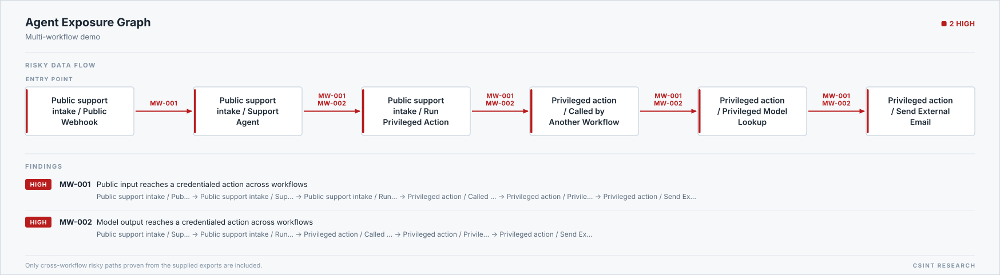

# n8n multi-workflow trust boundary report

Source: `workflows/multi-workflow-demo`

## Summary

| Metric | Count |
| --- | ---: |
| Workflows | 2 |
| Nodes | 6 |
| Workflow calls | 1 |
| Resolved calls | 1 |
| Unresolved calls | 0 |
| Credential aliases | 2 |
| Findings | 3 |

## Findings

### MW-001 — Public input reaches a credentialed action across workflows

Severity: **HIGH**

The exported call graph contains a cross-workflow path from an untrusted trigger to a credentialed side effect without an explicit approval boundary.

Remediation: Authenticate the entry point, add an explicit approval gate before the action, and use a narrow credential in the called workflow.

Path: Public support intake / Public Webhook → Public support intake / Support Agent → Public support intake / Run Privileged Action → Privileged action / Called by Another Workflow → Privileged action / Privileged Model Lookup → Privileged action / Send External Email

### MW-002 — Model output reaches a credentialed action across workflows

Severity: **HIGH**

The exported call graph contains a cross-workflow path from a model node to a credentialed side effect without an explicit approval boundary.

Remediation: Constrain model output, add a human approval boundary, and separate read credentials from write credentials.

Path: Public support intake / Support Agent → Public support intake / Run Privileged Action → Privileged action / Called by Another Workflow → Privileged action / Privileged Model Lookup → Privileged action / Send External Email

### MW-003-01 — credential-01 is reused across 2 workflows

Severity: **MEDIUM**

The same exported credential reference appears in: Privileged action, Public support intake. The report intentionally omits its raw name and ID.

Remediation: Review the real permission scope and split intake/read credentials from approved send/write credentials.

## Limitations

- Static exports do not reveal the real permissions granted to a credential.
- Dynamic or missing workflow targets require manual review.
- A clean result is not proof that the workflows are secure.
