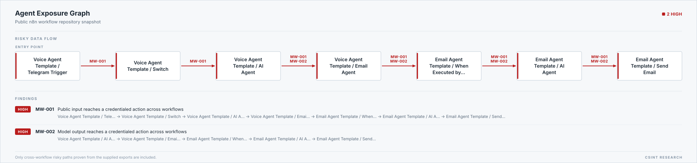

# n8n multi-workflow trust boundary report

Source: `C:\Users\AhmetGöker\AppData\Local\Temp\csint-n8n-workflows-3abab9021e674d93bd8c127f724476fb\repo`

## Summary

| Metric | Count |
| --- | ---: |
| Workflows | 24 |
| Nodes | 297 |
| Workflow calls | 8 |
| Resolved calls | 5 |
| Unresolved calls | 3 |
| Credential aliases | 43 |
| Findings | 15 |

## Findings

### MW-001 — Public input reaches a credentialed action across workflows

Severity: **HIGH**

The exported call graph contains a cross-workflow path from an untrusted trigger to a credentialed side effect without an explicit approval boundary.

Remediation: Authenticate the entry point, add an explicit approval gate before the action, and use a narrow credential in the called workflow.

Path: Voice Agent Template / Telegram Trigger → Voice Agent Template / Switch → Voice Agent Template / AI Agent → Voice Agent Template / Email Agent → Email Agent Template / When Executed by Another Workflow → Email Agent Template / AI Agent → Email Agent Template / Send Email

### MW-002 — Model output reaches a credentialed action across workflows

Severity: **HIGH**

The exported call graph contains a cross-workflow path from a model node to a credentialed side effect without an explicit approval boundary.

Remediation: Constrain model output, add a human approval boundary, and separate read credentials from write credentials.

Path: Voice Agent Template / AI Agent → Voice Agent Template / Email Agent → Email Agent Template / When Executed by Another Workflow → Email Agent Template / AI Agent → Email Agent Template / Send Email

### MW-003-02 — credential-02 is reused across 2 workflows

Severity: **MEDIUM**

The same exported credential reference appears in: Threads Credentials Setup, Threads Posting Automation. The report intentionally omits its raw name and ID.

Remediation: Review the real permission scope and split intake/read credentials from approved send/write credentials.

### MW-003-03 — credential-03 is reused across 2 workflows

Severity: **MEDIUM**

The same exported credential reference appears in: BlueSky Post, Email Responder Agent. The report intentionally omits its raw name and ID.

Remediation: Review the real permission scope and split intake/read credentials from approved send/write credentials.

### MW-003-04 — credential-04 is reused across 2 workflows

Severity: **MEDIUM**

The same exported credential reference appears in: Newsletter Capture Automation, YouTube Automation. The report intentionally omits its raw name and ID.

Remediation: Review the real permission scope and split intake/read credentials from approved send/write credentials.

### MW-003-05 — credential-05 is reused across 2 workflows

Severity: **MEDIUM**

The same exported credential reference appears in: Lead Capture CRM, Notion Daily Briefing. The report intentionally omits its raw name and ID.

Remediation: Review the real permission scope and split intake/read credentials from approved send/write credentials.

### MW-003-15 — credential-15 is reused across 3 workflows

Severity: **MEDIUM**

The same exported credential reference appears in: Contact Agent Template, Email Agent Template, Research Agent Template. The report intentionally omits its raw name and ID.

Remediation: Review the real permission scope and split intake/read credentials from approved send/write credentials.

### MW-003-19 — credential-19 is reused across 2 workflows

Severity: **MEDIUM**

The same exported credential reference appears in: Email Responder Agent, RD-Calendar Agent. The report intentionally omits its raw name and ID.

Remediation: Review the real permission scope and split intake/read credentials from approved send/write credentials.

### MW-003-21 — credential-21 is reused across 2 workflows

Severity: **MEDIUM**

The same exported credential reference appears in: RD-Calendar Agent, RD-Notion Agent. The report intentionally omits its raw name and ID.

Remediation: Review the real permission scope and split intake/read credentials from approved send/write credentials.

### MW-003-25 — credential-25 is reused across 3 workflows

Severity: **MEDIUM**

The same exported credential reference appears in: BlueSky Post, Email Responder Agent, URL Status Workflow. The report intentionally omits its raw name and ID.

Remediation: Review the real permission scope and split intake/read credentials from approved send/write credentials.

### MW-003-37 — credential-37 is reused across 2 workflows

Severity: **MEDIUM**

The same exported credential reference appears in: Social Media Manager AI Agent, Social Media Manager Telegram Trigger. The report intentionally omits its raw name and ID.

Remediation: Review the real permission scope and split intake/read credentials from approved send/write credentials.

### MW-003-41 — credential-41 is reused across 2 workflows

Severity: **MEDIUM**

The same exported credential reference appears in: Social Media Manager AI Agent, Social Media Manager Telegram Trigger. The report intentionally omits its raw name and ID.

Remediation: Review the real permission scope and split intake/read credentials from approved send/write credentials.

### MW-004-01 — Sub-workflow target could not be resolved (ambiguous)

Severity: **MEDIUM**

Email Responder Agent / Calendar Agent refers to a workflow that is not uniquely present in this export set.

Remediation: Export the complete workflow set with stable workflow IDs, then review the unresolved call before deployment.

### MW-004-02 — Sub-workflow target could not be resolved (unresolved)

Severity: **MEDIUM**

Parent Agent / Notion Agent refers to a workflow that is not uniquely present in this export set.

Remediation: Export the complete workflow set with stable workflow IDs, then review the unresolved call before deployment.

### MW-004-03 — Sub-workflow target could not be resolved (unresolved)

Severity: **MEDIUM**

Parent Agent / Calendar Agent refers to a workflow that is not uniquely present in this export set.

Remediation: Export the complete workflow set with stable workflow IDs, then review the unresolved call before deployment.

## Limitations

- Static exports do not reveal the real permissions granted to a credential.
- Dynamic or missing workflow targets require manual review.
- A clean result is not proof that the workflows are secure.
